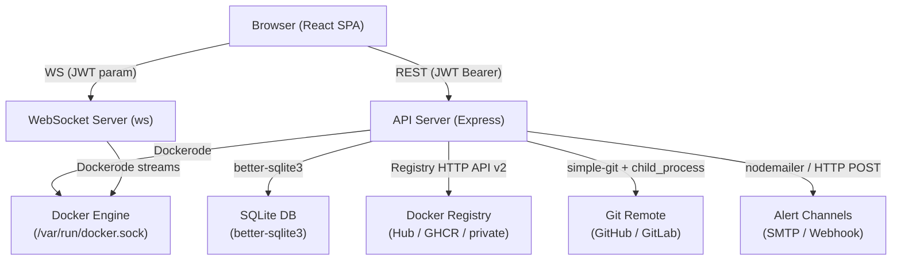
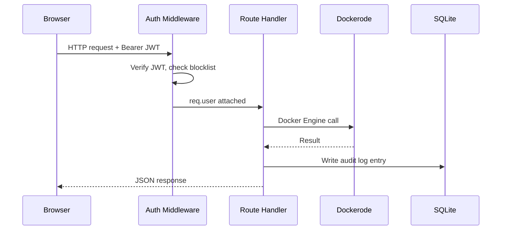
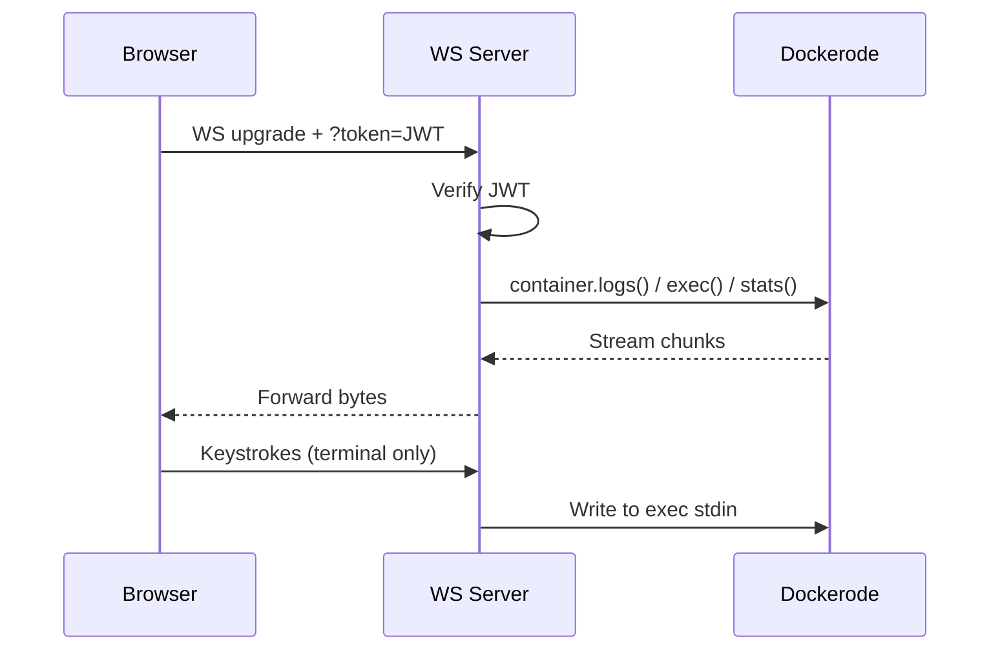

# Design Document: DockMaster Dashboard

## Overview

DockMaster is a self-hosted Docker management dashboard providing a Portainer-like experience. The system is split into a React/Vite frontend and a Node.js/Express backend. The backend communicates with the Docker Engine via the Unix socket using Dockerode, exposes a REST API and WebSocket endpoints, and persists audit logs and configuration in SQLite. The frontend is a dark-themed single-page application built with shadcn/ui components, Tailwind CSS, and Recharts (via shadcn/ui chart primitives).

The four delivery phases are:
- Phase 1 (MVP): Container listing, lifecycle actions, deploy from form
- Phase 2 (Core Infrastructure): Git deploy, registry integration, logs/metrics, Swarm, browser terminal
- Phase 3 (Security & Access): JWT auth, RBAC, audit logs
- Phase 4 (Monitoring & Alerts): Real-time resource graphs, crash/health alerts

### Key Technical Decisions

| Concern | Choice | Rationale |
|---|---|---|
| Browser terminal | xterm.js + xterm-addon-fit | De-facto standard for browser PTY; fits inside a shadcn/ui Dialog |
| Charts | Recharts via shadcn/ui `<ChartContainer>` | Already in the shadcn/ui chart primitive; no extra dep |
| WebSockets | `ws` library (server) + native `WebSocket` (client) | Lighter than Socket.IO for this use case; no room/namespace needed |
| SQLite ORM | better-sqlite3 (synchronous) | Simple, zero-config, fast for audit log writes |
| Git deploy | `simple-git` npm package | Thin wrapper around git CLI; avoids shelling out manually |
| Registry API | Docker Registry HTTP API v2 | Standard; works with Docker Hub, GHCR, GitLab, and private registries |
| Password encryption | bcrypt (10 rounds) | Standard for stored passwords; registry credentials AES-256-GCM encrypted |
| JWT | jsonwebtoken, 24h expiry, HS256 | Simple, stateless; token blocklist in SQLite for logout |
| State management | React Context + useReducer | Avoids Redux overhead for this scale |
| Routing | react-router-dom v6 | Standard SPA routing with protected route wrappers |

---

## Architecture



### Request Flow (REST)



### WebSocket Flow (Logs / Terminal / Stats)



---

## Components and Interfaces

### Frontend Component Tree

```
App
├── AuthProvider (Context)
├── Router
│   ├── /login → LoginPage
│   └── ProtectedLayout (requires JWT)
│       ├── AppShell
│       │   ├── Sidebar (shadcn/ui NavigationMenu + Sheet for mobile)
│       │   └── TopHeader (page title + username)
│       └── Routes
│           ├── /                  → DashboardHome
│           │   ├── StatCards (total/running/stopped containers, images)
│           │   └── GlobalMetricsChart (CPU area + memory bar, WS feed)
│           ├── /containers        → ContainersPage
│           │   ├── ContainerTable (shadcn/ui Table)
│           │   └── ContainerRow (action buttons, loading state)
│           ├── /containers/:id    → ContainerDetailPage
│           │   └── InspectPanel (env, ports, volumes, networks)
│           ├── /images            → ImagesPage
│           │   └── ImageTable
│           ├── /stacks            → StacksPage
│           │   └── StackTable + DeployStackDialog
│           ├── /services          → ServicesPage
│           │   └── ServiceTable + ScaleDialog
│           ├── /registries        → RegistriesPage
│           │   └── RegistryList + AddRegistryForm
│           ├── /deploy            → DeployPage
│           │   ├── DeployFormTab (image-based)
│           │   └── GitDeployTab (git-based + build log WS)
│           ├── /terminal/:id      → TerminalPage
│           │   └── XtermPanel (xterm.js + WS)
│           ├── /logs/:id          → LogsPage
│           │   └── LogViewer (ScrollArea + WS + tail selector)
│           ├── /metrics/:id       → MetricsPage
│           │   └── ContainerMetricsChart (CPU/mem/net area charts)
│           ├── /nodes             → NodesPage
│           │   └── NodeTable + AddNodeForm
│           ├── /volumes           → VolumesPage
│           │   └── VolumeTable
│           ├── /networks          → NetworksPage
│           │   └── NetworkTable
│           ├── /users             → UsersPage (Admin only)
│           │   └── UserTable + CreateUserDialog
│           ├── /audit-logs        → AuditLogsPage
│           │   └── AuditLogTable (paginated)
│           └── /alerts            → AlertsSettingsPage
│               └── AlertConfigForm
```

### Key Frontend Interfaces (TypeScript-style for clarity)

```ts
// Auth context
interface AuthContext {
  user: { username: string; role: 'admin' | 'viewer' } | null;
  token: string | null;
  login(username: string, password: string): Promise<void>;
  logout(): void;
}

// API client (src/services/api.js)
// Axios instance with baseURL and Authorization interceptor
// All methods throw on non-2xx; caller handles with toast

// WebSocket hook
function useContainerLogs(containerId: string, tail: number): {
  lines: string[];
  connected: boolean;
  reconnect(): void;
}

function useContainerStats(containerId: string): {
  snapshots: StatSnapshot[];  // last 60
  latest: StatSnapshot | null;
}

function useGlobalStats(): {
  snapshots: GlobalSnapshot[];  // last 30
}
```

### Backend Route Map

| Method | Path | Handler | Auth |
|---|---|---|---|
| POST | /api/auth/login | auth.login | public |
| POST | /api/auth/logout | auth.logout | JWT |
| GET | /api/containers | containers.list | JWT |
| POST | /api/containers/deploy | containers.deploy | JWT+Admin |
| GET | /api/containers/:id/inspect | containers.inspect | JWT |
| POST | /api/containers/:id/start | containers.start | JWT+Admin |
| POST | /api/containers/:id/stop | containers.stop | JWT+Admin |
| POST | /api/containers/:id/restart | containers.restart | JWT+Admin |
| DELETE | /api/containers/:id | containers.remove | JWT+Admin |
| GET | /api/containers/:id/stats | containers.stats | JWT |
| GET | /api/images | images.list | JWT |
| DELETE | /api/images/:id | images.remove | JWT+Admin |
| GET | /api/services | services.list | JWT |
| POST | /api/services/:id/scale | services.scale | JWT+Admin |
| DELETE | /api/services/:id | services.remove | JWT+Admin |
| GET | /api/stacks | stacks.list | JWT |
| POST | /api/stacks | stacks.deploy | JWT+Admin |
| DELETE | /api/stacks/:name | stacks.remove | JWT+Admin |
| GET | /api/registries | registries.list | JWT |
| POST | /api/registries | registries.create | JWT+Admin |
| GET | /api/registries/:id/images | registries.listImages | JWT |
| POST | /api/registries/:id/test | registries.test | JWT+Admin |
| GET | /api/nodes | nodes.list | JWT |
| POST | /api/nodes | nodes.create | JWT+Admin |
| DELETE | /api/nodes/:id | nodes.remove | JWT+Admin |
| GET | /api/nodes/:id/health | nodes.health | JWT |
| GET | /api/volumes | volumes.list | JWT |
| DELETE | /api/volumes/:name | volumes.remove | JWT+Admin |
| GET | /api/networks | networks.list | JWT |
| DELETE | /api/networks/:id | networks.remove | JWT+Admin |
| GET | /api/users | users.list | JWT+Admin |
| POST | /api/users | users.create | JWT+Admin |
| PUT | /api/users/:id | users.update | JWT+Admin |
| DELETE | /api/users/:id | users.remove | JWT+Admin |
| GET | /api/audit-logs | auditLogs.list | JWT+Admin |
| POST | /api/deploy/git | deploy.git | JWT+Admin |
| GET | /api/alerts/config | alerts.getConfig | JWT+Admin |
| POST | /api/alerts/config | alerts.saveConfig | JWT+Admin |

### WebSocket Endpoints

| Path | Direction | Purpose |
|---|---|---|
| /api/containers/:id/logs | server→client | Stream container stdout/stderr |
| /api/containers/:id/terminal | bidirectional | PTY exec session via xterm.js |
| /api/deploy/git/:jobId/logs | server→client | Live build log output |
| /api/stats/stream | server→client | Broadcast all-container stats every 5s |

All WebSocket connections authenticate via `?token=<JWT>` query parameter on the upgrade request.

### Backend Service Layer

```
src/
├── api/              # Express routers (thin, delegate to services)
├── services/
│   ├── docker_client.js      # Dockerode singleton (local socket)
│   ├── node_client.js        # Per-node Dockerode instances (map by nodeId)
│   ├── container_service.js  # Container CRUD + lifecycle
│   ├── swarm_service.js      # Services + stacks
│   ├── registry_service.js   # Registry CRUD + Registry HTTP API v2
│   ├── deploy_service.js     # Form deploy + Git deploy (simple-git)
│   ├── stats_service.js      # Stats polling + WS broadcast
│   ├── terminal_service.js   # Exec session management
│   ├── alert_service.js      # Event listener + email/webhook dispatch
│   ├── audit_service.js      # Write + query audit log entries
│   └── auth_service.js       # JWT sign/verify + bcrypt + blocklist
├── middlewares/
│   ├── auth_middleware.js    # JWT verification + role check
│   └── audit_middleware.js   # Auto-log mutating requests
├── db/
│   ├── schema.js             # better-sqlite3 schema init
│   └── db.js                 # DB singleton
└── ws/
    ├── logs_ws.js            # /api/containers/:id/logs handler
    ├── terminal_ws.js        # /api/containers/:id/terminal handler
    ├── git_logs_ws.js        # /api/deploy/git/:jobId/logs handler
    └── stats_ws.js           # /api/stats/stream handler
```

---

## Data Models

### SQLite Schema

```sql
-- Users
CREATE TABLE users (
  id        INTEGER PRIMARY KEY AUTOINCREMENT,
  username  TEXT NOT NULL UNIQUE,
  password  TEXT NOT NULL,          -- bcrypt hash
  role      TEXT NOT NULL CHECK(role IN ('admin','viewer')),
  created_at INTEGER NOT NULL DEFAULT (unixepoch())
);

-- JWT blocklist (for logout / role change invalidation)
CREATE TABLE token_blocklist (
  jti       TEXT PRIMARY KEY,       -- JWT ID claim
  expires_at INTEGER NOT NULL       -- unix timestamp; GC entries past this
);

-- Audit logs
CREATE TABLE audit_logs (
  id          INTEGER PRIMARY KEY AUTOINCREMENT,
  timestamp   INTEGER NOT NULL DEFAULT (unixepoch()),
  actor       TEXT NOT NULL,        -- username
  action      TEXT NOT NULL,        -- e.g. "container.stop"
  target_id   TEXT,                 -- container/image/service ID
  target_name TEXT,
  outcome     TEXT NOT NULL CHECK(outcome IN ('success','failure')),
  detail      TEXT                  -- JSON blob for extra context
);
CREATE INDEX idx_audit_timestamp ON audit_logs(timestamp DESC);
CREATE INDEX idx_audit_actor     ON audit_logs(actor);
CREATE INDEX idx_audit_action    ON audit_logs(action);

-- Docker node configurations
CREATE TABLE nodes (
  id          INTEGER PRIMARY KEY AUTOINCREMENT,
  hostname    TEXT NOT NULL,
  ip_address  TEXT NOT NULL,
  port        INTEGER NOT NULL DEFAULT 2376,
  tls_cert    TEXT,                 -- PEM content, nullable
  created_at  INTEGER NOT NULL DEFAULT (unixepoch())
);

-- Registry configurations
CREATE TABLE registries (
  id          INTEGER PRIMARY KEY AUTOINCREMENT,
  name        TEXT NOT NULL,
  url         TEXT NOT NULL,
  username    TEXT NOT NULL,
  password    TEXT NOT NULL,        -- AES-256-GCM encrypted, base64
  created_at  INTEGER NOT NULL DEFAULT (unixepoch())
);

-- Alert configuration (single row, upserted)
CREATE TABLE alert_config (
  id              INTEGER PRIMARY KEY CHECK(id = 1),
  smtp_host       TEXT,
  smtp_port       INTEGER,
  smtp_user       TEXT,
  smtp_pass       TEXT,             -- AES-256-GCM encrypted
  email_recipients TEXT,           -- comma-separated
  webhook_url     TEXT,
  cpu_threshold   INTEGER NOT NULL DEFAULT 90
);
```

### API Payload Shapes

```ts
// POST /api/auth/login
{ username: string; password: string }
// → { token: string; user: { id, username, role } }

// POST /api/containers/deploy
{
  image: string;          // required
  name?: string;
  env?: Record<string, string>;
  ports?: { host: number; container: number }[];
  volumes?: { host: string; container: string }[];
  restartPolicy?: 'no' | 'always' | 'on-failure' | 'unless-stopped';
}

// POST /api/deploy/git
{
  repositoryUrl: string;
  branch?: string;          // default: "main"
  dockerfilePath?: string;  // default: "Dockerfile"
  imageTag: string;
  env?: Record<string, string>;
}
// → { jobId: string }  (client then opens WS for build logs)

// GET /api/containers/:id/stats response
{
  containerId: string;
  name: string;
  cpu: number;        // percentage 0-100
  memory: number;     // MB
  networkRx: number;  // bytes
  networkTx: number;  // bytes
  timestamp: number;  // unix ms
}

// GET /api/audit-logs response
{
  entries: AuditLogEntry[];
  total: number;
  page: number;
  pageSize: number;  // 50
}

// WS /api/stats/stream broadcast message
{ containers: { containerId, name, cpu, memory }[] }
```

### In-Memory State (Frontend)

```ts
// AuthContext
{ user, token }

// Per-page local state (useState / useReducer)
// ContainersPage: containers[], loadingIds: Set<string>
// LogsPage: lines: string[], connected: boolean, tail: number
// MetricsPage: snapshots: StatSnapshot[]  (capped at 60)
// DashboardHome: globalSnapshots: GlobalSnapshot[]  (capped at 30)
```

---

## Correctness Properties

*A property is a characteristic or behavior that should hold true across all valid executions of a system — essentially, a formal statement about what the system should do. Properties serve as the bridge between human-readable specifications and machine-verifiable correctness guarantees.*

### Property 1: Container row buttons match container state

*For any* container object, the action buttons rendered in the container table row should exactly match the container's state: running containers show Start, Stop, Restart, and Remove; non-running containers show only Start and Remove.

**Validates: Requirements 2.3, 2.4**

---

### Property 2: Container table renders all required fields

*For any* array of container objects returned by the API, the rendered table should contain a row for each container displaying name, image, status, state, created time, and exposed ports.

**Validates: Requirements 2.2, 2.1**

---

### Property 3: Viewer role hides all action buttons

*For any* container list rendered with a Viewer-role JWT, no lifecycle action buttons (Start, Stop, Restart, Remove) should appear in any row.

**Validates: Requirements 2.10, 14.2**

---

### Property 4: Viewer JWT causes 403 on all mutating endpoints

*For any* mutating HTTP request (POST, PUT, DELETE) to any protected API endpoint made with a Viewer-role JWT, the API server should return HTTP 403.

**Validates: Requirements 14.2**

---

### Property 5: Container detail page renders all inspect fields

*For any* container inspect payload returned by `GET /api/containers/:id/inspect`, the detail page should render container ID, image, command, created timestamp, environment variables, port bindings, volume mounts, network settings, and restart policy.

**Validates: Requirements 3.2**

---

### Property 6: Deploy form submit disabled for empty/whitespace image name

*For any* string composed entirely of whitespace characters (or the empty string) entered in the image name field, the deploy form submit button should remain disabled.

**Validates: Requirements 4.6**

---

### Property 7: Image table renders all required fields

*For any* array of image objects returned by the API, the rendered table should contain a row for each image displaying repository, tag, short image ID, size in MB, and created date.

**Validates: Requirements 5.2, 5.1**

---

### Property 8: Log viewer renders all lines and scrolls to newest

*For any* array of log lines received over the WebSocket, the Log_Viewer should render all lines in order and the scroll position should be at the newest (last) line.

**Validates: Requirements 6.2**

---

### Property 9: Tail selector re-establishes stream with correct value

*For any* tail value selected from the options (50, 100, 500, All), the Log_Viewer should close the existing WebSocket and open a new one with the corresponding `tail` query parameter.

**Validates: Requirements 6.4**

---

### Property 10: Metrics chart retains at most 60 data points

*For any* sequence of stats snapshots received by the per-container metrics chart, the number of retained data points should never exceed 60 (oldest are evicted when the limit is reached).

**Validates: Requirements 7.4**

---

### Property 11: CPU warning highlight applied above 80%

*For any* stats snapshot where the CPU usage value exceeds 80%, the CPU chart component should apply a warning color class; for any snapshot at or below 80%, no warning class should be applied.

**Validates: Requirements 7.6**

---

### Property 12: Terminal bidirectional relay

*For any* sequence of keystrokes sent from the browser terminal, the API server should forward each keystroke to the exec session stdin; and for any bytes produced by the exec session stdout/stderr, the API server should forward them to the browser WebSocket so xterm.js renders them.

**Validates: Requirements 8.4, 8.5**

---

### Property 13: Open Terminal button disabled for non-running containers

*For any* container not in the `running` state, the "Open Terminal" button should be disabled and a tooltip should be visible explaining the container must be running.

**Validates: Requirements 8.7**

---

### Property 14: Git deploy cleans up temp directory on completion

*For any* Git deploy job (whether it succeeds or fails), the temporary clone directory created during the job should be removed after the job finishes.

**Validates: Requirements 9.7**

---

### Property 15: Registry passwords never returned in plaintext

*For any* registry object returned by `GET /api/registries` or `GET /api/registries/:id`, the response should not contain the plaintext password field.

**Validates: Requirements 10.3**

---

### Property 16: Scale action updates service replica count

*For any* Swarm service and any valid desired replica count, calling `POST /api/services/:id/scale` should result in `service.update()` being called with the new replica count, and the services list should reflect the updated desired replica count.

**Validates: Requirements 11.4**

---

### Property 17: JWT contains role claim and 24-hour expiry

*For any* successful login with valid credentials, the returned JWT should decode to contain a `role` field (either `admin` or `viewer`) and an `exp` claim approximately 24 hours from the time of issuance.

**Validates: Requirements 13.2, 14.1**

---

### Property 18: All API requests after login include Bearer JWT

*For any* API request made by the frontend after a successful login, the `Authorization` header should contain `Bearer <token>` where `<token>` matches the JWT stored in localStorage.

**Validates: Requirements 13.4**

---

### Property 19: Expired or absent JWT redirects to login

*For any* navigation to a protected route when the JWT is absent or expired, the application should redirect the user to `/login`.

**Validates: Requirements 13.5**

---

### Property 20: Protected routes return 401 for invalid JWT

*For any* HTTP request to a protected API endpoint with a missing, malformed, or expired JWT, the API server should return HTTP 401.

**Validates: Requirements 13.6**

---

### Property 21: Logout invalidates token on server

*For any* JWT that has been used to call `POST /api/auth/logout`, subsequent requests using that same JWT to any protected endpoint should return HTTP 401 (token is blocklisted).

**Validates: Requirements 13.8**

---

### Property 22: Audit log entry written for every mutating action

*For any* mutating action (container lifecycle, deploy, scale, user management) performed through the API, an audit log entry should be written to SQLite containing timestamp, actor username, action type, target resource ID, and outcome.

**Validates: Requirements 15.1**

---

### Property 23: Audit log entries round-trip through SQLite

*For any* audit log entry written to the SQLite database, reading it back and serializing to JSON should produce the same fields and values that were originally written.

**Validates: Requirements 15.4, 20.3**

---

### Property 24: Audit log table sorted by timestamp descending

*For any* audit log dataset, the entries returned by `GET /api/audit-logs` should be ordered by timestamp in descending order (newest first), and the UI table should reflect this ordering.

**Validates: Requirements 15.2**

---

### Property 25: Audit log filter returns only matching entries

*For any* combination of filter parameters (actor, action type, date range) passed to `GET /api/audit-logs`, all returned entries should satisfy every specified filter criterion.

**Validates: Requirements 15.3**

---

### Property 26: Global stats chart retains at most 30 snapshots

*For any* sequence of broadcast messages received on `ws://host/api/stats/stream`, the number of retained snapshots in the global metrics chart should never exceed 30.

**Validates: Requirements 16.5**

---

### Property 27: Stats stream broadcasts every 5 seconds

*For any* active WebSocket connection to `/api/stats/stream`, the server should emit a broadcast message at approximately 5-second intervals containing a JSON array of `{ containerId, name, cpu, memory }` objects for all running containers.

**Validates: Requirements 16.3**

---

### Property 28: Container die event with non-zero exit code triggers alert

*For any* Docker `die` event received with a non-zero exit code, the alert service should invoke the notification dispatch function for all configured alert channels.

**Validates: Requirements 17.1, 17.2, 17.3**

---

### Property 29: CPU threshold alert fires after 3 consecutive breaches

*For any* container where CPU usage exceeds the configured threshold for 3 or more consecutive stats polls, the alert service should trigger exactly one alert (not one per poll after the threshold is crossed).

**Validates: Requirements 17.6**

---

### Property 30: Alert config GET redacts sensitive fields

*For any* alert configuration stored in the database, the response from `GET /api/alerts/config` should not contain plaintext SMTP passwords or webhook tokens.

**Validates: Requirements 17.5**

---

### Property 31: Volume table renders all required fields

*For any* array of volume objects returned by the API, the rendered table should display name, driver, mount point, and in-use status for each volume.

**Validates: Requirements 18.1**

---

### Property 32: Network table renders all required fields

*For any* array of network objects returned by the API, the rendered table should display name, driver, subnet, and connected containers for each network.

**Validates: Requirements 18.3**

---

### Property 33: Node health check responds within 5 seconds

*For any* node configuration, `GET /api/nodes/:id/health` should return a reachable or unreachable status within 5 seconds regardless of the node's actual availability.

**Validates: Requirements 19.4**

---

### Property 34: Container inspect payload JSON round-trip

*For any* container inspect payload returned by `GET /api/containers/:id/inspect`, parsing the JSON response and re-serializing it should produce a JSON string that deserializes to an equivalent object (no fields lost or mutated).

**Validates: Requirements 20.2**

---

## Error Handling

### HTTP Error Conventions

| Scenario | HTTP Status | Response Shape |
|---|---|---|
| Missing/invalid JWT | 401 | `{ error: "Unauthorized" }` |
| Viewer attempts mutation | 403 | `{ error: "Forbidden" }` |
| Resource not found | 404 | `{ error: "Not found", id }` |
| Resource in use (image/volume/network) | 409 | `{ error: "Conflict", detail }` |
| Malformed JSON body | 400 | `{ error: "Bad request", detail }` |
| Validation failure (image pull, YAML parse, git clone) | 422 | `{ error: "Unprocessable", detail }` |
| Swarm not active | 503 | `{ error: "Swarm mode not active" }` |
| Docker Engine unreachable | 503 | `{ error: "Docker Engine unavailable" }` |
| Unexpected server error | 500 | `{ error: "Internal server error" }` |

### Frontend Error Handling

- All Axios errors are caught in a global response interceptor
- 401 responses trigger an automatic redirect to `/login` and clear localStorage
- 403 responses show a shadcn/ui Toast: "You don't have permission to perform this action"
- 409 responses show a Toast with the conflict detail message
- 422 responses show a shadcn/ui Alert inline in the relevant form/page
- 500 responses show a generic Toast: "Something went wrong, please try again"
- WebSocket disconnections set a `connected: false` flag; the UI shows a "Disconnected" Badge and a Reconnect button

### Backend Error Handling

- All route handlers are wrapped in try/catch; errors are passed to the Express error middleware
- Dockerode errors are mapped to appropriate HTTP status codes (e.g., 404 for "no such container")
- Git clone and Docker build errors are streamed to the client via the build log WebSocket before the job is marked failed
- Email delivery failures are logged and a single retry is scheduled after 60 seconds using `setTimeout`
- The global Express error handler logs the full stack trace and returns a sanitized 500 response (no stack traces exposed to clients)

---

## Testing Strategy

### Dual Testing Approach

Both unit tests and property-based tests are required. They are complementary:
- Unit tests catch concrete bugs with specific inputs and verify integration points
- Property-based tests verify universal correctness across randomized inputs

### Property-Based Testing Library

**Backend**: [fast-check](https://github.com/dubzzz/fast-check) (TypeScript/JavaScript)
**Frontend**: [fast-check](https://github.com/dubzzz/fast-check) with React Testing Library

Each property test must run a minimum of **100 iterations**.

Each property test must be tagged with a comment in this format:
```
// Feature: dockmaster-dashboard, Property N: <property_text>
```

### Unit Tests

Focus areas:
- Auth middleware: valid JWT passes, expired JWT returns 401, missing JWT returns 401, Viewer JWT on mutating route returns 403
- Audit middleware: mutating requests trigger `audit_service.write()` with correct fields
- Container service: `deploy()` calls `docker.pull` then `container.start` in order
- Stats service: CPU percentage calculation from raw Docker stats (delta CPU / system delta)
- Alert service: die event with exit code 0 does not trigger alert; exit code != 0 does
- SQLite schema: tables created correctly on first run; idempotent on subsequent runs
- JWT service: `sign()` produces decodable token with correct claims; `verify()` rejects blocklisted JTI

### Property-Based Tests

Each correctness property from the design maps to exactly one property-based test:

| Property | Test Description | Arbitraries |
|---|---|---|
| P1 | Container row buttons match state | `fc.record({ State: fc.constantFrom('running','exited','paused') })` |
| P2 | Container table renders all fields | `fc.array(containerArb)` |
| P3 | Viewer hides action buttons | `fc.array(containerArb)` with Viewer context |
| P4 | Viewer JWT → 403 on mutations | `fc.constantFrom(...mutatingEndpoints)` |
| P5 | Inspect page renders all fields | `fc.record(inspectPayloadArb)` |
| P6 | Empty image name disables submit | `fc.string().filter(s => s.trim() === '')` |
| P7 | Image table renders all fields | `fc.array(imageArb)` |
| P8 | Log viewer renders all lines | `fc.array(fc.string())` |
| P9 | Tail selector re-establishes WS | `fc.constantFrom(50, 100, 500, 'all')` |
| P10 | Metrics retains ≤ 60 points | `fc.array(statsArb, { minLength: 61, maxLength: 200 })` |
| P11 | CPU warning above 80% | `fc.float({ min: 0, max: 100 })` |
| P12 | Terminal bidirectional relay | `fc.array(fc.uint8Array())` |
| P13 | Terminal button disabled when not running | `fc.constantFrom('exited','paused','created')` |
| P14 | Git deploy cleans temp dir | `fc.record(gitDeployArb)` |
| P15 | Registry passwords not in response | `fc.array(registryArb)` |
| P16 | Scale updates replica count | `fc.integer({ min: 0, max: 100 })` |
| P17 | JWT contains role + 24h expiry | `fc.constantFrom('admin','viewer')` |
| P18 | Requests include Bearer JWT | `fc.string()` (token) |
| P19 | Expired JWT redirects to login | expired JWT fixture |
| P20 | Invalid JWT → 401 | `fc.string()` (invalid tokens) |
| P21 | Logout invalidates token | valid JWT fixture |
| P22 | Audit log written for mutations | `fc.constantFrom(...mutatingActions)` |
| P23 | Audit log SQLite round-trip | `fc.record(auditEntryArb)` |
| P24 | Audit log sorted desc | `fc.array(auditEntryArb)` |
| P25 | Audit log filter matches | `fc.record(filterArb)` + `fc.array(auditEntryArb)` |
| P26 | Global stats retains ≤ 30 snapshots | `fc.array(globalStatsArb, { minLength: 31, maxLength: 100 })` |
| P27 | Stats stream broadcasts every 5s | timing-based with fake timers |
| P28 | Die event triggers alert | `fc.integer({ min: 1, max: 255 })` (exit codes) |
| P29 | CPU threshold alert after 3 polls | `fc.array(fc.float({ min: 91, max: 100 }), { minLength: 3 })` |
| P30 | Alert config GET redacts secrets | `fc.record(alertConfigArb)` |
| P31 | Volume table renders all fields | `fc.array(volumeArb)` |
| P32 | Network table renders all fields | `fc.array(networkArb)` |
| P33 | Node health responds within 5s | `fc.record(nodeArb)` |
| P34 | Inspect payload JSON round-trip | `fc.record(inspectPayloadArb)` |

### Integration Tests

- Full login → protected request → logout flow
- Container deploy form → API → Dockerode mock → container list refresh
- WebSocket log stream: connect → receive lines → disconnect → reconnect button appears
- Audit log: perform action → query audit log → entry present with correct fields

### Test Configuration

```js
// vitest.config.js (frontend)
// jest.config.js (backend)
// fast-check default: 100 runs per property
// Use fc.configureGlobal({ numRuns: 100 }) in test setup
```
